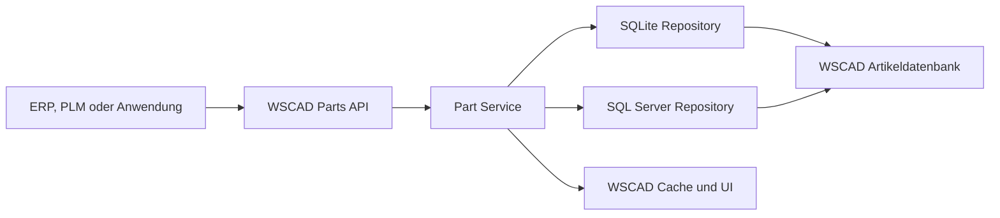

# WSCAD Parts API - Direkte Datenbankintegration

## 1. Zielbild

Die WSCAD API stellt eine einheitliche fachliche Schnittstelle zum Lesen und Schreiben von Artikeldaten bereit. Sie arbeitet direkt mit der in ELECTRIX konfigurierten WSCAD-Artikeldatenbank und unterstützt SQLite und SQL Server.

Es gibt:

- keine Zwischendatenbank,
- keine zweite Kopie der Artikelstammdaten,
- keine Datenbanktabellen im öffentlichen API-Vertrag,
- keine datenbankspezifischen Requests,
- keine parallele Artikel-API neben den vorhandenen `/parts`-Endpoints.



Die API behandelt einen Artikel als fachliches Gesamtobjekt. Der Part Service löst Hersteller, Lieferant, Bauform und weitere Relationen auf und schreibt alle betroffenen Tabellen innerhalb einer Transaktion.

## 2. Vorhandene Endpoints, die weiterverwendet werden

### 2.1 Direkt wiederverwendbar

| Status | Endpoint | Bestehende Funktion | Verwendung in der neuen Artikel-API |
|---|---|---|---|
| **Vorhanden** | `GET /api/v1/parts` | Teile filtern und seitenweise laden | Bleibt der Standardendpoint für Artikellisten und exakte Filter. |
| **Vorhanden** | `GET /api/v1/parts/search` | Volltextähnliche Teilesuche | Bleibt für interaktive Suchfelder und Auswahldialoge bestehen. |
| **Vorhanden** | `GET /api/v1/parts/usage` | Verwendung anhand der Teilenummer ermitteln | Wird vor Stilllegung, Ersatz und Massentausch wiederverwendet. |
| **Vorhanden** | `PUT /api/v1/parts/load-in-cursor` | Artikel in den WSCAD-Cursor laden | Kann nach Import oder Auswahl unverändert verwendet werden. |
| **Vorhanden** | `GET /api/v1/tasks/{id}` | Asynchronen Task abfragen | Wird für Bulk-Upsert, Massenfreigabe und Artikelersetzung wiederverwendet. |

### 2.2 Vorhandene unterstützende Endpoints

| Endpoint | Wiederverwendung |
|---|---|
| `GET /api/v1/symbols` | Symbolnamen für Artikelzuordnungen auswählen oder validieren. |
| `GET /api/v1/symbols/search` | Symbolzuordnungen über Technologie und Suchtext finden. |
| `GET /api/v1/projects` | Projekt-IDs für eine gezielte Artikelersetzung auswählen. |
| `GET /api/v1/projects/{id}` | Projekt vor einer Ersetzung prüfen. |
| `POST /api/v1/universe/import-part` | Bleibt Universe-spezifisch, verwendet intern aber denselben neuen Part Service. |

### 2.3 Notwendige Erweiterungen vorhandener Responses

`GET /api/v1/parts` und `GET /api/v1/parts/search` sollten in jedem Listeneintrag zusätzlich liefern:

- `partId` als technische, stabile ID aus `article.artAutoValue`,
- `partNumber`,
- Hersteller-ID und Herstellername,
- Lifecycle-Kurzstatus,
- Revision,
- Änderungszeitpunkt,
- `version` für Konkurrenzschutz.

Neue optionale Felder in bestehenden Responses sind abwärtskompatibel. Bestehende Clients können sie ignorieren.

### 2.4 Erweiterungen vorhandener Filter

`GET /api/v1/parts` sollte zusätzlich unterstützen:

- `manufacturerId`
- `vendorId`
- `module`
- `technology`
- `category`
- `availabilityStatus`
- `approvalStatus`
- `revision`
- `changedSince`
- `pageNumber`
- `pageSize`

Die vorhandenen Parameter `partnumber`, `name` und `manufacturer` bleiben erhalten.

## 3. Minimale neue Endpoint-Oberfläche

### 3.1 Artikel lesen und prüfen

| Status | Methode | Endpoint | Zweck | Response |
|---|---|---|---|---|
| **Neu** | `GET` | `/api/v1/parts/{partId}` | Vollständigen Artikel lesen | `PartDetails` |
| **Neu** | `POST` | `/api/v1/parts/validate` | Artikelrequest vollständig prüfen, ohne zu schreiben | `PartValidationResult` |
| **Neu** | `GET` | `/api/v1/parts/metadata` | Unterstützte Felder, Typen, Einheiten und Enums liefern | `PartMetadata` |
| **Neu** | `GET` | `/api/v1/parts/changes` | Änderungen für ERP/PLM über stabilen Cursor liefern | `PartChangePage` |

### 3.2 Artikel schreiben

| Status | Methode | Endpoint | Zweck | Response |
|---|---|---|---|---|
| **Neu** | `POST` | `/api/v1/parts` | Artikel vollständig anlegen | `201 PartWriteResult` |
| **Neu** | `PATCH` | `/api/v1/parts/{partId}` | Ausgewählte Artikelbereiche ändern | `PartWriteResult` |
| **Neu** | `POST` | `/api/v1/parts/upsert` | Artikel anhand eines Business-Key anlegen oder aktualisieren | `PartWriteResult` |
| **Neu** | `POST` | `/api/v1/parts/batch/validate` | Mehrere Artikel ohne Schreiben prüfen | `PartBatchValidationResult` oder Task |
| **Neu** | `POST` | `/api/v1/parts/batch/upsert` | Mehrere Artikel direkt verarbeiten | `202 TaskDetails` |
| **Neu** | `GET` | `/api/v1/parts/jobs/{taskId}/items` | Einzelresultate eines Bulk-Tasks lesen | `PartJobItemPagedResult` |

Ein separates `PUT` für den vollständigen Ersatz eines Artikels ist nicht notwendig. `PATCH` verwendet eine eindeutige Segment-Semantik und verhindert, dass nicht übergebene Daten versehentlich gelöscht werden.

### 3.3 Freigabe und Lifecycle

| Status | Methode | Endpoint | Zweck | Response |
|---|---|---|---|---|
| **Neu** | `POST` | `/api/v1/parts/{partId}/approve` | Neuen Artikel freigeben | `PartLifecycleResult` |
| **Neu** | `POST` | `/api/v1/parts/batch/approve` | Mehrere Artikel freigeben | `202 TaskDetails` |
| **Neu** | `PATCH` | `/api/v1/parts/{partId}/lifecycle` | Verfügbarkeit, Sperre und Revision ändern | `PartLifecycleResult` |
| **Neu** | `PUT` | `/api/v1/parts/{partId}/substitute` | Ersatzartikel setzen | `PartSubstitutionResult` |
| **Neu** | `DELETE` | `/api/v1/parts/{partId}/substitute` | Ersatzartikelbezug entfernen | `204` |

Eine physische Artikellöschung ist nicht Bestandteil der öffentlichen API. Artikel werden über den Lifecycle stillgelegt, gesperrt oder als veraltet gekennzeichnet. Dadurch bleiben Referenzen und Änderungsverfolgung erhalten.

### 3.4 Hersteller, Lieferanten und Händler

Hersteller und Lieferanten sind eigenständige fachliche Ressourcen. Intern werden sie in `adress` gespeichert.

| Status | Methode | Endpoint | Zweck | Response |
|---|---|---|---|---|
| **Neu** | `GET` | `/api/v1/business-partners` | Geschäftspartner nach Rolle, Schlüssel oder Name suchen | `BusinessPartnerPagedResult` |
| **Neu** | `POST` | `/api/v1/business-partners` | Hersteller, Lieferant oder Händler anlegen | `201 BusinessPartner` |
| **Neu** | `GET` | `/api/v1/business-partners/{partnerId}` | Geschäftspartner lesen | `BusinessPartner` |
| **Neu** | `PATCH` | `/api/v1/business-partners/{partnerId}` | Geschäftspartner ändern | `BusinessPartner` |

Eine Löschung ist nicht erforderlich. Ungültige Geschäftspartner werden deaktiviert, damit bestehende Artikelreferenzen erhalten bleiben.

### 3.5 Bauformen

| Status | Methode | Endpoint | Zweck | Response |
|---|---|---|---|---|
| **Neu** | `GET` | `/api/v1/outlines` | Bauformen suchen und auswählen | `OutlinePagedResult` |
| **Neu** | `POST` | `/api/v1/outlines` | Wiederverwendbare Bauform anlegen | `201 Outline` |
| **Neu** | `GET` | `/api/v1/outlines/{outlineId}` | Bauform lesen | `Outline` |
| **Neu** | `PATCH` | `/api/v1/outlines/{outlineId}` | Bauform ändern | `Outline` |

### 3.6 Artikelersetzung

Das Hinterlegen eines Ersatzartikels und das tatsächliche Ersetzen bereits verwendeter Artikel bleiben getrennte Vorgänge.

| Status | Methode | Endpoint | Zweck | Response |
|---|---|---|---|---|
| **Neu** | `POST` | `/api/v1/parts/replacements/preview` | Betroffene Verwendungen prüfen | `PartReplacementPreview` |
| **Neu** | `POST` | `/api/v1/parts/replacements` | Bestätigte Ersetzungen durchführen | `202 TaskDetails` |

Der Preview-Endpoint verwendet intern den vorhandenen Usage-Service. Die Ausführung verwendet die WSCAD-Projektlogik und schreibt nicht direkt in Projektdateien oder Projektdatenbanken.

### 3.7 Datenbankstatus

| Status | Methode | Endpoint | Zweck | Response |
|---|---|---|---|---|
| **Neu** | `GET` | `/api/v1/part-database/status` | Provider, Schema-Version und Schreibfähigkeit prüfen | `PartDatabaseStatus` |

Der Response enthält keine Connection Strings, Zugangsdaten oder frei wählbaren Datenbankpfade.

## 4. Endgültige Endpoint-Liste

### Vorhanden und weiterverwendet

```text
GET /api/v1/parts
GET /api/v1/parts/search
GET /api/v1/parts/usage
PUT /api/v1/parts/load-in-cursor
GET /api/v1/tasks/{id}
GET /api/v1/symbols
GET /api/v1/symbols/search
GET /api/v1/projects
GET /api/v1/projects/{id}
POST /api/v1/universe/import-part
```

### Neu erforderlich

```text
GET    /api/v1/parts/{partId}
POST   /api/v1/parts
PATCH  /api/v1/parts/{partId}
POST   /api/v1/parts/validate
POST   /api/v1/parts/upsert
POST   /api/v1/parts/batch/validate
POST   /api/v1/parts/batch/upsert
GET    /api/v1/parts/jobs/{taskId}/items
GET    /api/v1/parts/changes
GET    /api/v1/parts/metadata
POST   /api/v1/parts/{partId}/approve
POST   /api/v1/parts/batch/approve
PATCH  /api/v1/parts/{partId}/lifecycle
PUT    /api/v1/parts/{partId}/substitute
DELETE /api/v1/parts/{partId}/substitute
POST   /api/v1/parts/replacements/preview
POST   /api/v1/parts/replacements

GET    /api/v1/business-partners
POST   /api/v1/business-partners
GET    /api/v1/business-partners/{partnerId}
PATCH  /api/v1/business-partners/{partnerId}

GET    /api/v1/outlines
POST   /api/v1/outlines
GET    /api/v1/outlines/{outlineId}
PATCH  /api/v1/outlines/{outlineId}

GET    /api/v1/part-database/status
```

## 5. Öffentliches Artikelmodell

Die API verwendet fachliche Namen. Tabellen- und Legacy-Spaltennamen sind nur Bestandteil der internen Persistenzschicht.

### 5.1 `PartWriteRequest`

```json
{
  "partNumber": "2904602",
  "manufacturer": {
    "partnerId": 4711
  },
  "vendor": null,
  "classification": {
    "module": "ElectricalEngineering",
    "technology": "ElectricalEngineering",
    "category": 10,
    "subCategory": 5,
    "series": "QUINT"
  },
  "descriptions": {
    "typeName": "Power supply",
    "description1": "Primary switched-mode power supply",
    "description2": "24 V DC / 10 A",
    "comment": null
  },
  "commercial": {
    "orderNumber": "2904602",
    "price": 129.5,
    "currency": "EUR",
    "discount": 0,
    "laborCost": 0,
    "installationTime": "PT15M"
  },
  "technical": {
    "voltage": {
      "minimum": 100,
      "maximum": 240,
      "type": "AC"
    },
    "current": {
      "minimum": null,
      "maximum": 10
    },
    "powerLoss": 8.4,
    "ambientTemperature": {
      "minimum": -25,
      "maximum": 70
    },
    "outerDiameter": null,
    "weight": {
      "value": 1.2,
      "unit": "kg"
    }
  },
  "lifecycle": {
    "approvalStatus": "PendingApproval",
    "availabilityStatus": "Active",
    "revision": "A"
  },
  "representations": {
    "symbols": {
      "electrical1Pole": "PSU_1P",
      "electrical3Pole": "PSU_3P",
      "cabinet": "PSU_FRONT",
      "fluid": null,
      "installation": null,
      "buildingAutomation": null,
      "pipingAndInstrumentation": null
    },
    "model3d": {
      "fileName": "Phoenix/2904602.step",
      "rotation": {
        "x": 0,
        "y": 0,
        "z": 0
      },
      "mirror": {
        "x": false,
        "y": false,
        "z": false
      }
    },
    "outline": {
      "outlineId": 815
    },
    "cabinetFootprints": [
      {
        "width": 35,
        "height": 130,
        "depth": 125,
        "symbolLibrary": "PSU_FRONT"
      }
    ]
  },
  "buildingAutomation": null,
  "components": [],
  "texts": [
    {
      "textId": 1,
      "translations": {
        "de": "Stromversorgung",
        "en": "Power supply"
      }
    }
  ],
  "attributes": [
    {
      "name": "UL_SCCR_KA",
      "type": "number",
      "value": 65,
      "unit": "kA"
    },
    {
      "name": "UL_FILE_NUMBER",
      "type": "text",
      "value": "E123456"
    }
  ],
  "source": {
    "system": "SAP",
    "externalId": "MAT-2904602",
    "requestId": "erp-2026-08-26-000184"
  }
}
```

### 5.2 Hersteller direkt im Artikelrequest auflösen

Wenn die Partner-ID nicht bekannt ist, darf der Artikelrequest den Hersteller eindeutig beschreiben:

```json
{
  "manufacturer": {
    "match": {
      "role": "Manufacturer",
      "externalKey": "PHOENIX_CONTACT"
    },
    "createIfMissing": {
      "name": "Phoenix Contact GmbH & Co. KG",
      "country": "DE",
      "town": "Blomberg"
    }
  }
}
```

Die API führt Auflösung, gegebenenfalls Partneranlage und Artikelanlage innerhalb derselben Transaktion aus.

Unscharfes Name-Matching darf keinen Geschäftspartner automatisch auswählen. Mehrere Treffer führen zu `409 BUSINESS_PARTNER_AMBIGUOUS`.

### 5.3 `PartWriteResult`

```json
{
  "operation": "Created",
  "partId": 84512,
  "partNumber": "2904602",
  "version": "W/\"84512-20260826T151423Z\"",
  "lifecycle": {
    "approvalStatus": "PendingApproval",
    "availabilityStatus": "Active",
    "revision": "A"
  },
  "resolvedRelations": {
    "manufacturer": {
      "partnerId": 4711,
      "resolution": "Reused"
    },
    "vendor": null,
    "outline": {
      "outlineId": 815,
      "resolution": "Reused"
    }
  },
  "changedSegments": [
    "core",
    "commercial",
    "technical",
    "representations",
    "texts",
    "attributes"
  ],
  "warnings": []
}
```

### 5.4 `PATCH /api/v1/parts/{partId}`

Der Request enthält nur die zu ändernden Segmente:

```json
{
  "commercial": {
    "price": 134.9,
    "currency": "EUR"
  },
  "lifecycle": {
    "revision": "B"
  },
  "attributes": {
    "mode": "Merge",
    "items": [
      {
        "name": "UL_SCCR_KA",
        "type": "number",
        "value": 80,
        "unit": "kA"
      }
    ]
  }
}
```

Segmentmodi:

- `Merge`: übergebene Einträge anlegen oder aktualisieren, übrige erhalten.
- `Replace`: Segment vollständig durch den Request ersetzen.
- `Remove`: Segment oder ausgewählte Einträge entfernen.

Normale PATCH-Requests dürfen `partNumber` nicht ändern. Eine Umnummerierung betrifft zahlreiche Relationen und benötigt bei späterem Bedarf einen eigenen Preview-/Execute-Workflow.

## 6. Interne Zuordnung zur WSCAD-Datenbank

Diese Zuordnung ist Implementierungsdetail und wird nicht im öffentlichen Request sichtbar.

| API-Bereich | WSCAD-Tabelle | Relation |
|---|---|---|
| Basis-, Klassifikations-, kaufmännische und technische Daten | `article` | Zentraler Datensatz |
| Hersteller | `adress` | `article.artManufacturer -> adress.adrAutoValue` |
| Lieferant/Händler | `adress` | `article.artVendor -> adress.adrAutoValue` |
| Freie Zusatzattribute | `articleAttribute` | `attArticle -> article.artNumber` |
| 2D-Symbole | `articleBibSymb` | `bibsymbArticle -> article.artNumber` |
| 3D-Modell | `article3D` | `a3dArticle -> article.artNumber` |
| Wiederverwendbare Bauform | `articleBauform` | `article.artBauform -> articleBauform.bauName` |
| Cabinet-Footprints | `articleCabinet` | `cabArticle -> article.artNumber` |
| Building Automation | `articleBA` | `baaArticle -> article.artNumber` |
| Kombiartikel | `articleCombi` | Master und Komponenten referenzieren `article.artNumber` |
| Mehrsprachige Texte | `articleLexicon` | `lexArticle -> article.artNumber` |
| Kommunikationsprofil | `CommunicationProfile` | Referenz über `cprId` |
| Schema-Version | `VersionInfo` | Auswahl des passenden Repository-Mappings |

## 7. Transaktionsablauf beim Anlegen eines Artikels

1. Token, Lizenz und Berechtigung prüfen.
2. Request und fachliche Pflichtfelder validieren.
3. Schema-Version der aktiven Artikeldatenbank prüfen.
4. Datenbanktransaktion starten.
5. Hersteller eindeutig auflösen oder anlegen.
6. Lieferant/Händler eindeutig auflösen oder anlegen.
7. Bauform und Kommunikationsprofil prüfen.
8. Business-Key des Artikels auf Eindeutigkeit prüfen.
9. Hauptdatensatz in `article` anlegen.
10. Symbole, 3D-Modell und Cabinet-Footprints schreiben.
11. BA-Daten schreiben.
12. Komponenten des Kombiartikels prüfen und schreiben.
13. Mehrsprachige Texte schreiben.
14. Dynamische Attribute typgerecht schreiben.
15. Freigabe- und Verfügbarkeitsstatus setzen.
16. Transaktion committen.
17. WSCAD-Artikelcache und Suchindex aktualisieren.
18. Response erzeugen.

Schlägt ein Schritt fehl, wird die gesamte Transaktion zurückgerollt. Ein unvollständiger Artikel darf nicht gespeichert werden.

## 8. Upsert und Bulk-Verarbeitung

### 8.1 Einzel-Upsert

```json
{
  "match": {
    "partNumber": "2904602"
  },
  "createIfMissing": true,
  "updateMode": "ProvidedFieldsOnly",
  "part": {
    "partNumber": "2904602",
    "manufacturer": {
      "partnerId": 4711
    },
    "commercial": {
      "price": 134.9,
      "currency": "EUR"
    },
    "lifecycle": {
      "revision": "B"
    }
  }
}
```

`operation` im Response ist `Created`, `Updated` oder `Unchanged`.

Der endgültige Business-Key muss aus der realen Datenbank bestätigt werden. Möglich sind:

- `partNumber`, oder
- Kombination aus `partNumber` und Hersteller.

### 8.2 Bulk-Upsert

```json
{
  "transactionMode": "PerPart",
  "stopOnError": false,
  "defaultApprovalStatus": "PendingApproval",
  "items": [
    {
      "clientItemId": "SAP-10001",
      "part": {
        "partNumber": "10001",
        "manufacturer": {
          "partnerId": 4711
        },
        "descriptions": {
          "typeName": "Contactor"
        }
      }
    }
  ]
}
```

Initialer Response verwendet das bestehende `TaskDetails`-Modell:

```json
{
  "id": "b7ff8d78-0dc7-4f95-92dc-fdb858cfa1b4",
  "state": "Running",
  "startTime": "2026-08-26T15:30:00Z",
  "result": null,
  "errorMessage": null
}
```

Nach Abschluss:

```json
{
  "id": "b7ff8d78-0dc7-4f95-92dc-fdb858cfa1b4",
  "state": "Completed",
  "startTime": "2026-08-26T15:30:00Z",
  "endTime": "2026-08-26T15:30:04Z",
  "result": {
    "received": 100,
    "created": 15,
    "updated": 80,
    "unchanged": 3,
    "failed": 2,
    "hasItemErrors": true
  },
  "errorMessage": null
}
```

`Completed` bedeutet, dass der Batch vollständig verarbeitet wurde. Einzelne Datensätze können trotzdem fehlgeschlagen sein. Diese werden über `/api/v1/parts/jobs/{taskId}/items` gelesen.

## 9. Änderungen für bidirektionale Integration lesen

`GET /api/v1/parts/changes?cursor={cursor}&pageSize=500`

Response:

```json
{
  "items": [
    {
      "changeType": "Updated",
      "partId": 84512,
      "partNumber": "2904602",
      "changedAt": "2026-08-26T15:30:04Z",
      "changedSegments": [
        "commercial",
        "lifecycle"
      ],
      "version": "W/\"84512-20260826T153004Z\""
    }
  ],
  "nextCursor": "eyJ0aW1lIjoiMjAyNi0wOC0yNlQxNTozMDowNFoiLCJpZCI6ODQ1MTJ9",
  "hasMore": false
}
```

Der Client speichert den Cursor. Eine serverseitige Acknowledgement-Tabelle ist nicht notwendig. Solange Artikel nicht physisch gelöscht werden, kann der Change-Feed aus Änderungszeitpunkt, stabiler ID und Lifecycle gebildet werden.

## 10. Lifecycle und Ersatzartikel

### Lifecycle-Request

```json
{
  "availabilityStatus": "Obsolete",
  "revision": "C",
  "reason": "Manufacturer discontinued the part"
}
```

### Ersatzartikel setzen

```json
{
  "substitutePartId": 91234,
  "substituteRevision": "A"
}
```

Die API verhindert:

- nicht vorhandene Ersatzartikel,
- Selbstreferenzen,
- zyklische Ersatzketten,
- fachlich unzulässige Ersatzartikel.

## 11. Artikelersetzung

### Preview

```json
{
  "mappings": [
    {
      "oldPartNumber": "2904602",
      "newPartNumber": "2904603"
    }
  ],
  "scope": {
    "projectIds": [
      "b52213e5-b67d-43c8-8aaa-a1ac7b711ad2"
    ]
  }
}
```

Response:

```json
{
  "previewId": "6cf1f6f2-1a14-4a83-bc34-423f8bfef56b",
  "affectedProjects": 1,
  "affectedOccurrences": 17,
  "conflicts": [],
  "expiresAt": "2026-08-26T16:30:00Z"
}
```

Die Ausführung akzeptiert nur eine gültige `previewId` und die bestätigte Anzahl betroffener Vorkommen.

## 12. Fehler- und Statusmodell

```json
{
  "code": "BUSINESS_PARTNER_AMBIGUOUS",
  "message": "The manufacturer could not be resolved uniquely.",
  "target": "manufacturer",
  "details": {
    "matches": 2
  },
  "traceId": "00-8f3c...-01"
}
```

| HTTP-Status | Verwendung |
|---:|---|
| `200` | Erfolgreich gelesen oder geändert |
| `201` | Ressource angelegt |
| `202` | Task gestartet |
| `204` | Relation entfernt |
| `400` | Request syntaktisch ungültig |
| `401` | Token fehlt oder ist ungültig |
| `403` | Berechtigung fehlt |
| `404` | Ressource nicht gefunden |
| `409` | Dublette, mehrdeutige Auflösung oder Referenzkonflikt |
| `412` | ETag stimmt nicht mehr |
| `422` | Fachlich ungültige Daten |
| `503` | Artikeldatenbank nicht erreichbar oder vorübergehend gesperrt |

Wichtige Fehlercodes:

- `PART_ALREADY_EXISTS`
- `PART_NOT_FOUND`
- `PART_IN_USE`
- `PART_NUMBER_CHANGE_NOT_ALLOWED`
- `BUSINESS_PARTNER_NOT_FOUND`
- `BUSINESS_PARTNER_AMBIGUOUS`
- `OUTLINE_NOT_FOUND`
- `COMPONENT_PART_NOT_FOUND`
- `SUBSTITUTE_PART_NOT_FOUND`
- `SUBSTITUTION_CYCLE`
- `INVALID_ATTRIBUTE_TYPE`
- `INVALID_ATTRIBUTE_VALUE`
- `SCHEMA_VERSION_UNSUPPORTED`
- `DATABASE_READ_ONLY`
- `DATABASE_BUSY`
- `CONCURRENCY_CONFLICT`

## 13. Berechtigungen

Für den ersten POC kann eine allgemeine API-Berechtigung verwendet werden. Die Endpoints werden dennoch so geschnitten, dass später Claims möglich sind.

| Berechtigung | Funktion |
|---|---|
| `parts.read` | Lesen, Suchen, Usage, Changes und Metadaten |
| `parts.write` | Anlegen, Ändern und Upsert |
| `parts.approve` | Artikel freigeben |
| `parts.lifecycle` | Status, Revision und Ersatzartikel |
| `parts.replace` | Artikel in Projekten ersetzen |
| `partners.write` | Hersteller und Lieferanten verwalten |

## 14. SQLite und SQL Server

Der öffentliche API-Vertrag ist für beide Datenbanken identisch.

### SQLite

- Schreibzugriffe pro Datenbank serialisieren.
- Transaktionen kurz halten.
- Sperrfehler als `DATABASE_BUSY` zurückgeben.
- Bulk-Operationen in kontrollierten Paketen verarbeiten.

### SQL Server

- Parametrisierte Statements verwenden.
- Sichere Transaktionsbehandlung aktivieren.
- Deadlocks kontrolliert wiederholen oder als retrybaren Fehler melden.
- Konkurrenzänderungen über dieselbe API-Versionierung wie bei SQLite behandeln.

### Gemeinsam

- Der passende Repository-Adapter wird anhand des konfigurierten Providers gewählt.
- `VersionInfo` bestimmt das Schema-Mapping.
- Nach einem Commit werden WSCAD-Cache und Suchindex aktualisiert.
- Kein Request enthält Connection Strings, Dateipfade oder SQL-Fragmente.

## 15. Was anhand einer echten Datenbank noch bestätigt werden muss

1. Eindeutiger Business-Key des Artikels.
2. Tatsächliche Foreign-Key- und Unique-Constraints.
3. Erlaubte Werte für Partnerrollen und Lifecycle-Felder.
4. Defaultwerte beim manuellen Anlegen eines Artikels.
5. Trigger und automatische Feldänderungen.
6. Kardinalität von `articleBibSymb` und `articleBA`.
7. Sprachspalten der aktuellen `articleLexicon`-Version.
8. Typabbildung dynamischer Attribute.
9. Unterschiede zwischen SQLite- und SQL-Server-Schema.
10. Mechanismus zur Aktualisierung des WSCAD-Artikelcache.

Aus einer SQLite-Datenbank beziehungsweise einem Schema-only-Export von SQL Server können daraus erstellt werden:

- exaktes ER-Diagramm,
- vollständiges Datenwörterbuch,
- Insert- und Update-Reihenfolge,
- providerabhängige Repository-Mappings,
- implementierungsfertige OpenAPI-Schemas,
- Integrationstests für beide Datenbanktypen.

## 16. Empfohlener POC

1. Vorhandenes `GET /api/v1/parts` um `partId`, Status und Version ergänzen.
2. Neues `GET /api/v1/parts/{partId}` implementieren.
3. Hersteller über `/business-partners` suchen.
4. Artikel mit vorhandenem Hersteller anlegen.
5. Hersteller und Artikel atomar gemeinsam anlegen.
6. Artikel mit `PATCH` aktualisieren.
7. Ein dynamisches Attribut schreiben.
8. Einzel-Upsert ausführen.
9. Bulk-Upsert mit vorhandenem `/tasks/{id}` verfolgen.
10. Alle Tests gegen SQLite und SQL Server ausführen.

## 17. Fazit

Die vorhandenen Parts-Endpoints werden nicht ersetzt, sondern zur vollständigen Artikel-API ausgebaut. Dadurch bleiben Suche, Usage und Cursorinteraktion kompatibel und Kunden erhalten einen zusammenhängenden `/parts`-Bereich.

Neu benötigt werden hauptsächlich Detail-, Create-, Patch-, Upsert-, Bulk-, Lifecycle-, Partner- und Replacement-Endpunkte. Die physische Datenbankstruktur bleibt vollständig hinter dem Part Service verborgen.

Die wichtigste interne Regel lautet weiterhin: Ein Artikelrequest wird als Gesamttransaktion verarbeitet. Beispielsweise wird ein Hersteller zuerst in `adress` aufgelöst oder angelegt und seine ID anschließend in `article.artManufacturer` gespeichert. Für den API-Verbraucher bleibt dies ein einziger fachlicher Vorgang.
